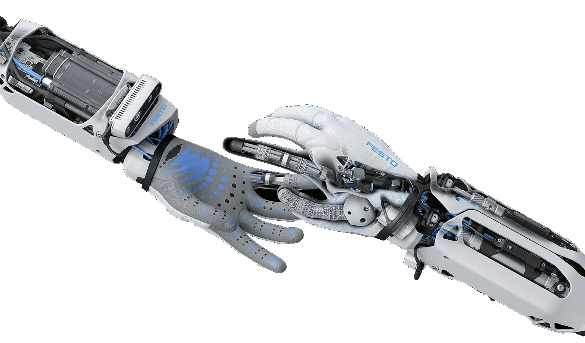
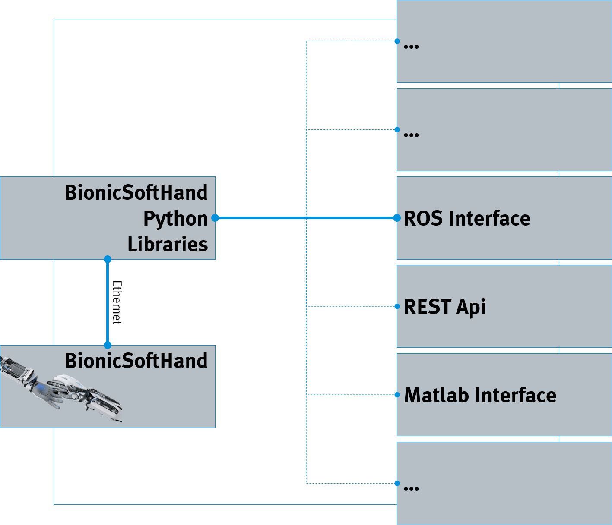

[](https://www.festo.com/group/en/cms/10156.htm)

> <p style="font-size:30px">BionicSoftHand 2.0 </p>

[](https://www.festo.com/group/en/cms/10156.htm)


<br>

# IMPORTANT NOTICES

> :warning: **If you open the case of the BionicSoftHand there is the possibility that you get in touch with the 300V piezo electronics! Avoid touching anything inside the case!**

> :warning: **The BionicSoftHand 2.0 works best with a pressure of 5.5 bars (650000 PSI)! If you go higher the hand can be damaged!** 

# SOFTWARE ARCHITECTURE
As you can see in the image below the Software architecture has a modular setup. The BionicSoftHand itself is programmed with C and communicates with its python libraries via ethernet. The python libraries provide a basic interface to communicate with the hand. To integrate it more into the robotic world, a ROS interface implementation is provided. Feel free to extend the list of interfaces with whatever you can think of. For example a REST api or an Matlab interface.


# INSTALL INSTRUCTIONS
This is the main repository for the BionicSoftHand 2.0. To install all the necessary drivers, follow these instructions. 

## Prerequisites

### Basic usage
* Installed version of [Python3](https://www.python.org/) on your computer.

### With ROS
* Tested on Ubuntu 16.04, 18.04 and 20.04
* Tested with ROS kinetic, melodic and noetic

## Setup BionicSoftHand Python Libraries

The BionicSoftHand Python Libraries provide the basic communication with the hand. You can use it on windows or linux. The installation script currently only works on linux.

Execute the following command to download and start the shell script:
```
bash <(wget -qO- https://raw.githubusercontent.com/Festo-se/festo-bionicsofthand-main/master/scripts/setup_phand_python.bash)
```

This will execute the following steps (which can also be executed manually):
1. Create the directories for the python libraries under /home/$USER/dev/phand/python_libs
2. Clone the related repositoreis
    * [PID controller](https://github.com/Festo-se/bionic-pid-control)
    * [DHCP library](https://github.com/Festo-se/bionic-dhcp)
    * [Bionic message tools](https://github.com/Festo-se/bionic-message-tools)
    * [BionicSoftHand python library](https://github.com/Festo-se/phand-python-libs)
3. Install each repository locally on your computer
4. Reload your terminal to load the libraries

## Setup BionicSoftHand with ROS

Please install the [BionicSoftHand Python Libraries](#Setup-BionicSoftHand-Python-Libraries) to use the ROS interface.

Execute the following command to download and start the shell script.:
```
bash <(wget -qO- https://raw.githubusercontent.com/Festo-se/festo-bionicsofthand-main/master/scripts/setup_phand_ros.bash)
```

This will execute the following steps (which can also be executed manually):
1. Create the directories for the ROS workspace under /home/$USER/dev/phand/phand_ws
2. Clone the related repository
    * [BionicSoftHand ROS](https://github.com/Festo-se/phand-ros)
3. Execute rosdep to install the ROS dependencies
4. Build & source the phand ROS environment

# LICENSE
The Festo BionicSoftHand python libraries are published under the [GNU GPL v3.0 License](https://www.gnu.org/licenses/gpl-3.0.de.html).